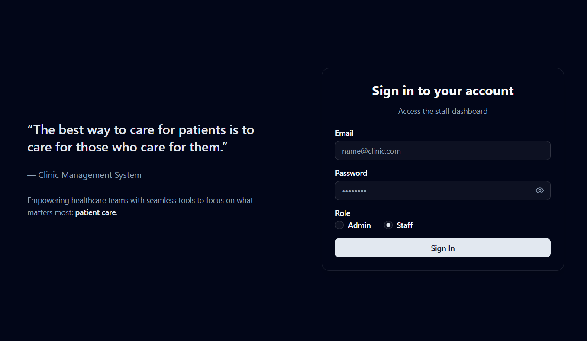

# Front Desk Management System

[](https://nextjs.org/)
[](https://expressjs.com/)
[](https://www.typescriptlang.org/)
[](https://ui.shadcn.com/)
[](https://tailwindcss.com/)


A modern, responsive clinic management system designed to streamline front-desk operations for healthcare facilities. The system enables efficient patient queue management, appointment scheduling, and staff coordination.

---

## 🚀 Live Demo

- **Frontend**: [https://allo-health-project.vercel.app](https://front-desk-management.vercel.app)  
- **Backend**: Hosted on Render (API endpoints consumed by frontend)

---

## 🛠️ Technology Stack

### Frontend
- **Framework**: Next.js 15 (App Router)
- **Language**: TypeScript
- **Styling**: Tailwind CSS + shadcn/ui components
- **State Management**: React Hooks (`useState`, `useEffect`, `useCallback`)
- **Routing**: Next.js App Router
- **Icons**: Lucide React
- **Toast Notifications**: Sonner
- **Deployment**: Vercel

### Backend
- **Framework**: Express.js
- **Language**: TypeScript
- **Database**: MongoDB (with Mongoose ODM)
- **Authentication**: JWT (JSON Web Tokens)
- **Validation**: Zod
- **Deployment**: Render

---

## ✨ Features

### 🔐 Authentication & Authorization
- Role-based login (Admin / Staff)
- Secure JWT authentication
- Auto-redirect based on user role
- Session persistence with localStorage

<p align="center">
    
    <i>Sign In Page(Dark)</i>
</p>


### 👥 Admin Dashboard
- **Doctor Management**:  
  - Add, edit, delete doctors  
  - Assign specializations  
  - View doctor availability

<p align="center">
    
    <i>Admin Page - Doctor Management(Dark)</i>
</p>

- **Staff Management**:  
  - Onboard new staff members  
  - Manage permissions

<p align="center">
    
    <i>Admin Page - Staff Management(Dark)</i>
</p>


### 📋 Staff Dashboard
- **Real-time Queue Management**:  
  - View today’s patient queue  
  - Track completed vs. waiting patients  
  - Handle emergency cases with visual indicators
- **Appointment Management**:  
  - View confirmed/upcoming appointments  
  - Mark appointments as completed
- **Add New Appointments**:  
  - Search existing patients by email  
  - Register new patients on-the-fly  
  - Assign available doctors based on selected time  
  - Real-time doctor availability check


<p align="center">
    
    <i>Staff Page - Queue Management, adding patient(Dark)</i>
</p>

### 🗂️ Patient Management
- Patient registration with full details (name, age, gender, contact, address)
- Automatic patient lookup by email
- Option to create new patient record even for existing emails (for corrections)

<p align="center">
    
    <i>Staff Page - Appointment Management, editing appointment(Light)</i>
</p>


### 🌓 User Experience
- **Dark/Light/System Theme Toggle**
- Responsive design (mobile & desktop)
- Loading skeletons for better perceived performance
- Per-section error handling with retry functionality
- Intuitive form validation
- Success/error toast notifications

---

## 🧪 Sample Credentials

### Admin Account
- **Email**: `admin1@gmail.com`
- **Password**: `12345678`

### Staff Account
*(Create via Admin Dashboard or use following)*

- **Email**: `staff1@gmail.com`
- **Password**: `12345678`


---

## 📦 Project Structure


```bash
.
├── backend
│   ├── prisma              # Database related files
│   │   └── migrations
│   └── src
│       ├── config
│       ├── database
│       ├── middlewares
│       ├── utils
│       └── v1          
│           ├── controllers
│           ├── repositories
│           ├── routes
│           ├── service
│           └── types
└── frontend
    ├── public
    └── src
        ├── app             # Main app pages
        │   └── (dashboard)
        │       ├── admin
        │       └── staff
        │           ├── appointments
        │           └── queue
        ├── components      # all components
        │   ├── admin
        │   ├── auth
        │   ├── staff
        │   └── ui          # Shadcn related components
        ├── config
        ├── lib             # Util function
        └── types           # All types for frontend

```
---

## 🚀 Getting Started

### Prerequisites
- Node.js v18+
- PostgreSQL instance
- `.env` file with required environment variables

> NOTE: Use values without double quotes(")
### Installation
1. **Clone the repository**
   ```bash
   git clone https://github.com/Shoyeb45/front-desk-management-system
   cd front-desk-management
   ```

2. **Install dependencies**
   ```bash
   npm install
   ```

3. **Set up environment variables**  
   - Create a `.env.local` file in the root directory:


    - Exmple of .env:

        1. Frontend(NextJS)

        ```bash
        NEXT_PUBLIC_BACKEND_URL="backend url wherever it is hosted"
        ``` 

        2. Backend(ExpressJS)

        ```bash

        DATABASE_URL="postgres sql connection string"
        JWT_SECRET="secret"
        JWT_EXPIRY="Expiry time, exm 10h"
        FRONTEND_URL="front end url wherever it is hosted"
        NODE_ENV="development or proudction"
        ```
4. **Run both the frontend and backend development server**
   ```bash
   npm run dev
   ```

5. **Open your browser**  
   Visit [http://localhost:3000](http://localhost:3000)

---

## 📤 Deployment

### Frontend (Vercel)
1. Connect your GitHub repository to Vercel
2. Set environment variables in Vercel project settings
3. Deploy automatically on push to `main` branch

### Backend (Render)
1. Create a new Web Service on Render
2. Connect your backend repository
3. Set environment variables (MongoDB URI, JWT secret, etc.)
4. Deploy with auto-redeploy on push

---

## 🤝 Contributing

Contributions are welcome! Please follow these steps:
1. Fork the repository
2. Create your feature branch (`git checkout -b feature/AmazingFeature`)
3. Commit your changes (`git commit -m 'Add some AmazingFeature'`)
4. Push to the branch (`git push origin feature/AmazingFeature`)
5. Open a Pull Request

---

## 📄 License

Distributed under the MIT License. See `LICENSE` for more information.

---

## 🙏 Acknowledgements

- [shadcn/ui](https://ui.shadcn.com/) for beautiful, accessible components
- [Tailwind CSS](https://tailwindcss.com/) for utility-first styling
- [Lucide Icons](https://lucide.dev/) for consistent iconography
- [Sonner](https://sonner.emilkowal.dev/) for elegant toast notifications
- [Docker](https://docker.com/) for amazing and easy containerization.
---

