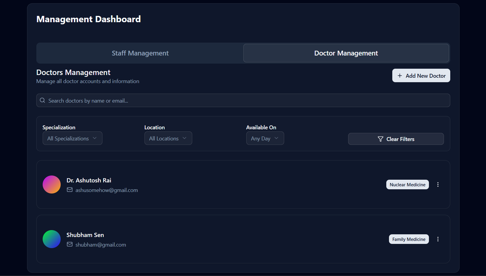
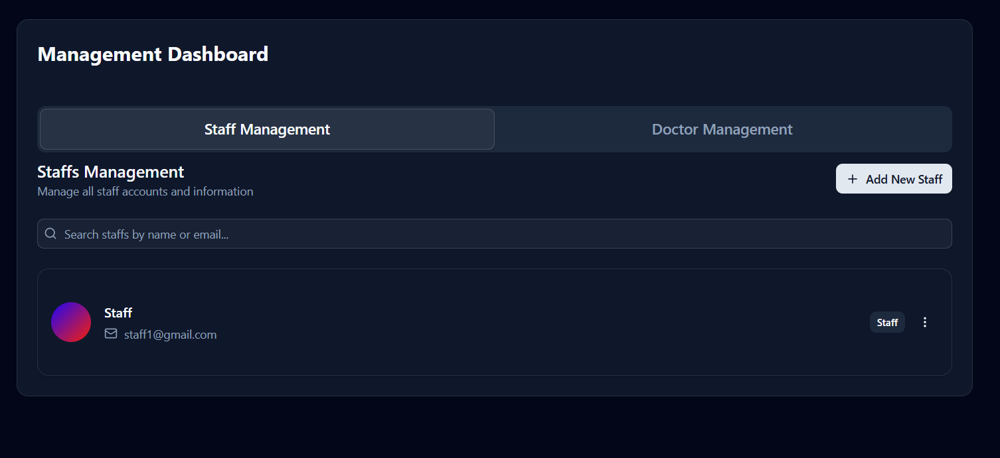
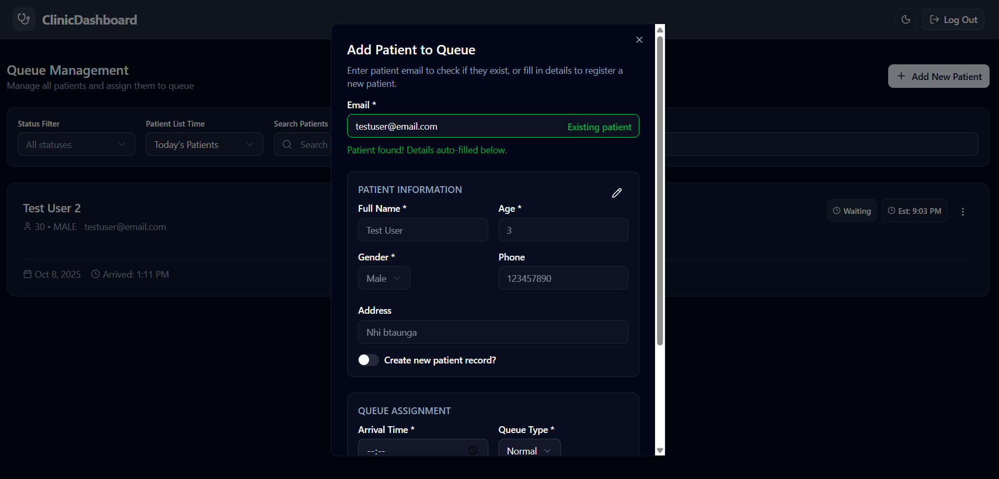

# Front Desk Management System

[](https://nextjs.org/)   [](https://expressjs.com/)  [](https://www.typescriptlang.org/)  [](https://ui.shadcn.com/)  [](https://tailwindcss.com/)  [](https://neon.tech/)  [](https://www.docker.com/)

A modern, responsive clinic management system designed to streamline front-desk operations for healthcare facilities. The system enables efficient patient queue management, appointment scheduling, and staff coordination.

---

## 🚀 Live Demo

- **Frontend**: [https://allo-health-project.vercel.app](https://allo-health-project.vercel.app)  
- **Backend**: Hosted on Render (API endpoints consumed by frontend)

---

## 🛠️ Technology Stack

### Frontend
- **Framework**: Next.js 15 (App Router)
- **Language**: TypeScript
- **Styling**: Tailwind CSS + shadcn/ui components
- **State Management**: React Hooks (`useState`, `useEffect`, `useCallback`)
- **Routing**: Next.js App Router
- **Icons**: Lucide React
- **Toast Notifications**: Sonner
- **Deployment**: Vercel

### Backend
- **Framework**: Express.js
- **Language**: TypeScript
- **Database**: **PostgreSQL** via [Neon](https://neon.tech/) (serverless, branching-enabled)
- **ORM**: Prisma
- **Authentication**: JWT (JSON Web Tokens)
- **Validation**: Zod
- **Containerization**: Docker
- **Deployment**: Render

---

## 🐳 Docker Support

The application is fully containerized for consistent local development and easy deployment.

### Features:
- Isolated frontend & backend services
- Pre-configured environment loading
- Hot-reload in development mode
- Production-ready image builds

### Usage:
```bash
# Build and start all services
docker-compose up --build

# Stop services
docker-compose down

# Rebuild after dependency changes
docker-compose build
```

> 💡 **Note**: Ensure your `.env` files are placed in the root before running. Docker Compose mounts them securely into containers.

---

## ✨ Features

### 🔐 Authentication & Authorization
- Role-based login (Admin / Staff)
- Secure JWT authentication
- Auto-redirect based on user role
- Session persistence with localStorage

<p align="center">
    
    <br>
    <i>Sign In Page (Dark)</i>
</p>

### 👥 Admin Dashboard
- **Doctor Management**:  
  - Add, edit, delete doctors  
  - Assign specializations  
  - View doctor availability

<p align="center">
    
    <br>
    <i>Admin Page - Doctor Management (Dark)</i>
</p>

- **Staff Management**:  
  - Onboard new staff members  
  - Manage permissions

<p align="center">
    
    <br>
    <i>Admin Page - Staff Management (Dark)</i>
</p>

### 📋 Staff Dashboard
- **Real-time Queue Management**:  
  - View today’s patient queue  
  - Track completed vs. waiting patients  
  - Handle emergency cases with visual indicators
- **Appointment Management**:  
  - View confirmed/upcoming appointments  
  - Mark appointments as completed
- **Add New Appointments**:  
  - Search existing patients by email  
  - Register new patients on-the-fly  
  - Assign available doctors based on selected time  
  - Real-time doctor availability check

<p align="center">
    
    <br>
    <i>Staff Page - Queue Management, adding patient (Dark)</i>
</p>

### 🗂️ Patient Management
- Patient registration with full details (name, age, gender, contact, address)
- Automatic patient lookup by email
- Option to create new patient record even for existing emails (for corrections)

<p align="center">
    
    <br>
    <i>Staff Page - Appointment Management, editing appointment (Light)</i>
</p>

### 🌓 User Experience
- **Dark/Light/System Theme Toggle**
- Responsive design (mobile & desktop)
- Loading skeletons for better perceived performance
- Per-section error handling with retry functionality
- Intuitive form validation
- Success/error toast notifications

---

## 🧪 Sample Credentials

### Admin Account
- **Email**: `admin1@gmail.com`
- **Password**: `12345678`

### Staff Account
- **Email**: `staff1@gmail.com`
- **Password**: `12345678`

> 🔒 For demo only. Never use in production.

---

## 📦 Project Structure

```bash
.
├── backend
│   ├── prisma              # Prisma schema & migrations
│   │   └── migrations
│   └── src
│       ├── config
│       ├── database        # Prisma client setup
│       ├── middlewares
│       ├── utils
│       └── v1
│           ├── controllers
│           ├── repositories
│           ├── routes
│           ├── service
│           └── types
├── frontend
│   ├── public
│   └── src
│       ├── app             # App Router pages
│       │   └── (dashboard)
│       │       ├── admin
│       │       └── staff
│       │           ├── appointments
│       │           └── queue
│       ├── components
│       │   ├── admin
│       │   ├── auth
│       │   ├── staff
│       │   └── ui          # shadcn/ui
│       ├── config
│       ├── lib             # Utilities
│       └── types           # TypeScript interfaces
└── docker-compose.yml      # Multi-container orchestration
```

---

## 🚀 Getting Started

### Prerequisites
- Node.js v18+
- Docker (optional but recommended)
- [Neon](https://neon.tech/) account (for cloud PostgreSQL)

### Using Neon DB (Recommended)
1. Sign up at [neon.tech](https://neon.tech/)
2. Create a new project → copy your **connection string**
3. Set it as `DATABASE_URL` in your backend `.env`

### Local Setup (Without Docker)
1. **Clone the repo**
   ```bash
   git clone https://github.com/Shoyeb45/front-desk-management-system
   cd front-desk-management-system
   ```

2. **Install dependencies**
   ```bash
   npm install
   ```

3. **Configure environment files**

   **Frontend** (`.env.local` in `/frontend`):
   ```env
   NEXT_PUBLIC_BACKEND_URL=https://your-backend.onrender.com
   ```

   **Backend** (`.env` in `/backend`):
   ```env
   DATABASE_URL=postgresql://... # From Neon
   JWT_SECRET=your_strong_secret_here
   JWT_EXPIRY=10h
   FRONTEND_URL=https://allo-health-project.vercel.app
   NODE_ENV=development
   ```

4. **Run services**
   ```bash
   # Terminal 1: Backend
   cd backend && npm run dev

   # Terminal 2: Frontend
   cd frontend && npm run dev
   ```

5. Visit [http://localhost:3000](http://localhost:3000)

---

## 📤 Deployment

### Frontend → Vercel
1. Import `frontend/` directory
2. Add `NEXT_PUBLIC_BACKEND_URL` in Vercel env vars
3. Deploy!

### Backend → Render
1. Deploy `backend/` as Web Service
2. Add all `.env` variables (including `DATABASE_URL` from Neon)
3. Enable auto-deploys

---

## 🤝 Contributing

We welcome contributions!  
1. Fork the repo  
2. Create a feature branch  
3. Commit & push  
4. Open a PR with a clear description

---

## 📄 License

Distributed under the **MIT License**. See [LICENSE](./LICENSE) for details.

---

## 🙏 Acknowledgements

- [shadcn/ui](https://ui.shadcn.com/) – Beautiful, accessible, and customizable components  
- [Tailwind CSS](https://tailwindcss.com/) – Utility-first CSS framework  
- [Lucide Icons](https://lucide.dev/) – Consistent, lightweight icons  
- [Sonner](https://sonner.emilkowal.dev/) – Elegant toast notifications  
- [Neon](https://neon.tech/) – Serverless PostgreSQL with branching  
- [Docker](https://www.docker.com/) – Reliable containerization for dev & prod

--- 

✅ **Ready for clinics. Built for developers.**